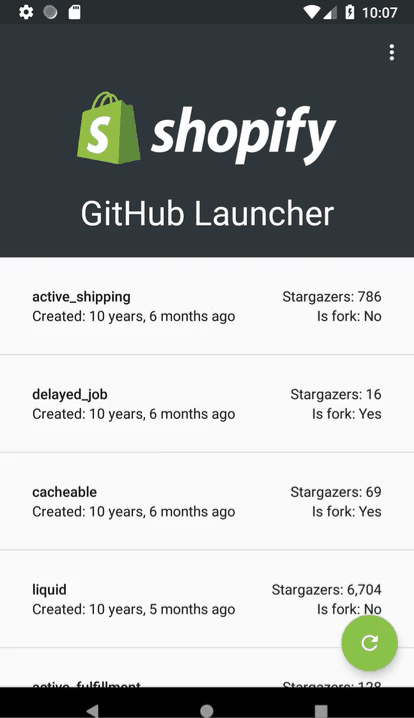

# android.github.shopify

A demostration app with a single recycler view, displaying public repositories for the Shopify organisation using the Github Developer API.

The recycler view displays the following information:

* Name
* If it is a fork or not (Y/N)
* Number of stargazers
* Time since it was created
* An interaction on the row which opens the user's browser to the repository's page

Goals:

* Solve the problem using Android (Kotlin preferred)
* Retrofit
* Back the recycler view with some type of cache or persistence layer
* Use an architecture pattern

# Architecture Pattern

The architectural pattern chosen was Model-View-Presenter (MVP) as a balance between separation of concerns, existing knowledge and speed to a minimum viable product.

# Libraries

3rd party libraries:

* okhttp
* retrofit
* joda-time

Google:

* gson
* recyclerview
* room

# To Do

* Dagger - at the moment injection is handled by an object that can be override for unit tests via product flavours
* Add a script that clicks through the app and records a video, stops and saves it to file.
* Implement loading / empty with retry / no network with retry
* List items - chips are clickable?  Setting foreground=transparent / clickabled = false / focusable = false didn't help.
* Rx - too much work is being done on the UI thread leading to some UI jank on the emulator when loading items
* Clean - implement use cases and separate layers into data / domain / presentation
* RecyclerView - sticky headers - a through z - requires a sortable / filterable repository
* Filter - who doesn't love a magnifying glass in their toolbar?
* Sort - Sort by fields displayed
* Unit tests
* Developed for Pixel 2 API 27 - test for more devices / screen sizes / API levels
* Tablet mode
* Configuration changes (orientation)
* Review Lint report
* Provide support for signing keys
* Event bus for highlighting source of data with a snackbar - `Loaded from <source> | OK`
* Separate memory / disk (room) / web layers with a status indicator of where the data is and it's size
* Add thread executor for background tasks like mapping - might be solved with Rx
* Free vs Paid - ad supported
* Choose any colour via a Settings menu, store in sharedprefs - Palette to extract colour from the Orgs icon?
* Co-ordinator layout
* Share sheet with text, email, QR Code and Nearby API support
* Navigation Drawer
* Authenitication via Login with Google / Facebook - Share with "my devices"
* Dependant API calls
    * https://api.github.com/orgs/shopify/repos
    * For each repo where fork: true -> https://api.github.com/repos/Shopify/delayed_job and return parent.full_name: "tobi/delayed_job"
* To Stateful Presenter or not
* Stetho
* Timber
* pidcat (on Windows? bash, Windows Subsystem for Linux, Python - yay!)
* Callgraphy for font-awesome / material icon font
* Dashboard with Cast API
* Smart watch ... listen for incoming connections / shares and open app on phone?  Small dashboard with notifications?

# Resources

* [Shopify on GitHub](https://github.com/Shopify)
* [GitHub Developer](https://developer.github.com)
* [Shopify Repositories via GitHub Developer API](https://api.github.com/orgs/shopify/repos)
* [Postman](https://www.getpostman.com/)
* [Android Jetpack](https://developer.android.com/jetpack/)
* [Android Jetpack - Guide to app architecture](https://developer.android.com/jetpack/docs/guide)
* [Android Architecture Blueprints](https://github.com/googlesamples/android-architecture)
* [Android Sunflower](https://github.com/googlesamples/android-sunflower)
* [Cheesesquare Sample](https://github.com/chrisbanes/cheesesquare)
* [Best practices in Android development](https://github.com/futurice/android-best-practices)
* [Complete Android Fragment & Activity Lifecycle](https://github.com/xxv/android-lifecycle)
* [Material Design - The development documentation](https://materialdoc.com/)
* [Kotlin style guide](https://developer.android.com/kotlin/style-guide)
* [apiwave](http://apiwave.com/java/api/junit.framework.Assert)
* [Build local unit tests](https://developer.android.com/training/testing/unit-testing/local-unit-tests)
